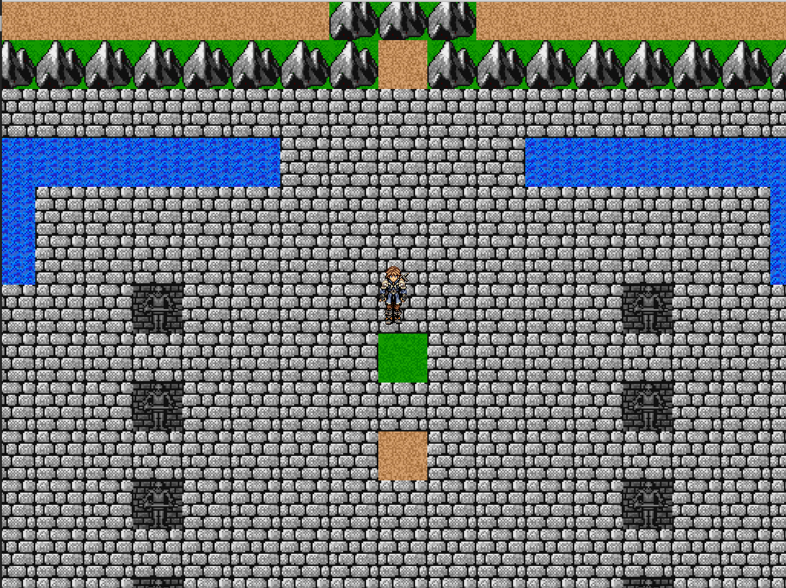

# Homeward - a 2D tilebased RPG

This was a project stub to learn some basic Java concepts while working on something I enjoy. The project is currently on hold.

Game Start View w/ an enemy unit (enemy unit moves w/ simple AI)

Game overworld view w/ town and portal

Town view with shop structures built but are not yet interactive

simple castle view no enemies or NPCs 
